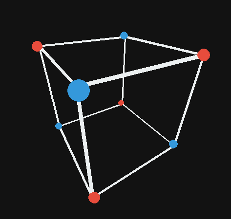
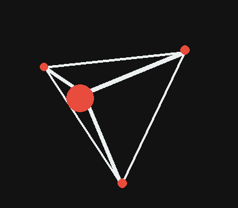
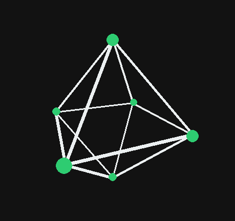
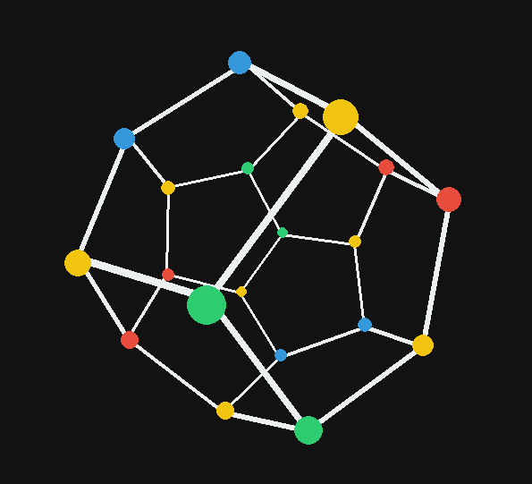
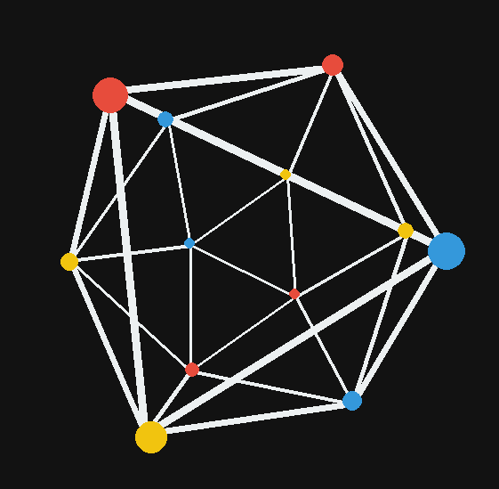
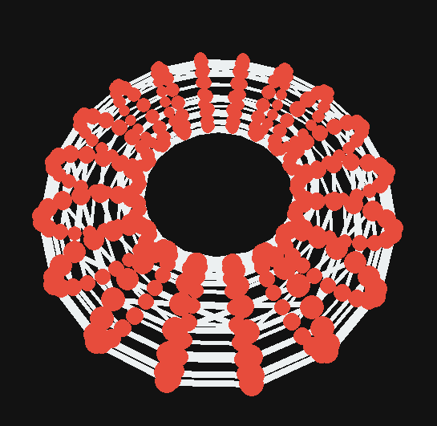

<h1 align="left">3d Shape Visualization</h1>

Visualization of various 3d shapes in 2d space.

Video Demo
<https://www.youtube.com/watch?v=DcCE7UvDWak>

<h2>Download</h2>

Install Python dependices Pygame run the main.py file

<h2>Shapes</h2>

<h3>Cube</h3>

<h3>Triangle</h3>

<h3>Octahedron</h3>

<h3>Dodecahedron</h3>

<h3>Icosahedron</h3>

<h3>Cone</h3>

<h3>Cylinder</h3>

<h3>Sphere</h3>

<h3>Torus</h3>

